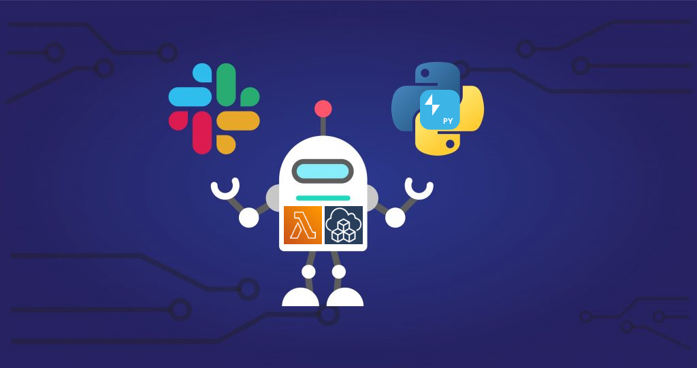

<p align="center">
  <a href="https://dev.to/vumdao">
    
  </a>
</p>
<h1 align="center">
  <div><b>SlackApi Bolt-python App With AWS Lambda And AWS CDK</b></div>
</h1>

## Abstract
- The story: Since the retirement of `rtm.start` and Slack recommends to not use the custom integration any more, so we need to move to new slack apps
- With new Slack App feature and [The Bolt family of SDKs](https://api.slack.com/tools/bolt), we can implement Slack bot with AWS serverless using Slash command or at-mention.
- This post will follow and extend the example from [slackapi/bolt-python](https://github.com/slackapi/bolt-python) and manage infrasture as code it using AWS CDK typescript.

## Table Of Contents
 * [Pre-requisite](#Pre-requisite)
 * [Create Slack App](#Create-Slack-App)
 * [Create lambda function with function URL](#Create-lambda-function-with-function-URL)
 * [Lambda handler](#Lambda-handler)
 * [Test the Slash command](#Test-the-Slash-command)
 * [Conclusion](#Conclusion)

---

## 🚀 **Pre-requisite** <a name="Pre-requisite"></a>
- You need slack workspace (free) to create slack app
- Getting started with AWS CDK

## 🚀 **Create Slack App** <a name="Create-Slack-App"></a>
- First, create slack app, provide permission for the bot user through `OAuth & Permissions` and then install to workspace. You can follow the guide from slack page

  

  

- Get `Bot User OAuth Token` from `OAuth Tokens for Your Workspace` under `OAuth & Permissions`
- Get Signing secret from `App Credentials` under `Basic Information`.
- Store Bot token and signing secret to `.env` file and ensure you already set ignore `.env` in `.gitignore` file. For better security we can let lambda function to get the credential from SSM parameter store or secret manager but it will slow down lambda operation a bit.

## 🚀 **Create lambda function with function URL** <a name="Create-lambda-function-with-function-URL"></a>
- Why do we need lambda function URL here? let's have a look at following overview diagram

  

- The lambda function URL is used as Request URL of Slash Command.
- Not sure about the flow, but the lambda function requires permission to invoke itself, otherwise we will get following error
  ```
  2022-09-30 10:47:35,222 Failed to run a middleware middleware (error: An error occurred (AccessDeniedException) when calling the Invoke operation: User: arn:aws:sts::123456789012:assumed-role/sin-d1-slack-app-lambda-role/sin-d1-slack-app-lambda-handler is not authorized to perform: lambda:InvokeFunction on resource: arn:aws:lambda:ap-southeast-1:123456789012:function:sin-d1-slack-app-lambda-handler because no identity-based policy allows the lambda:InvokeFunction action)
  ```
- The CDK construct here is simple since we do not run any real process or use other AWS services. The stack includes IAM role attached to the lambda function with enabling function URL. Note that the default timeout of lambda function 3s is not enough to run `process_request` so we need to set `timeout: Duration.seconds(10)`
  ```
  import { PythonFunction } from '@aws-cdk/aws-lambda-python-alpha';
  import { App, Duration, Stack, StackProps } from 'aws-cdk-lib';
  import { Role, ServicePrincipal } from 'aws-cdk-lib/aws-iam';
  import { FunctionUrlAuthType, Runtime } from 'aws-cdk-lib/aws-lambda';
  import { RetentionDays } from 'aws-cdk-lib/aws-logs';
  import { Construct } from 'constructs';
  import { join } from 'path';
  import { SLACK_BOT_TOKEN, SLACK_SIGNING_SECRET } from './shared/configs';
  import { devEnv, EnvironmentConfig } from './shared/environment';

  export class SlackAppTest extends Stack {
    constructor(scope: Construct, id: string, reg: EnvironmentConfig, props: StackProps = {}) {
      super(scope, id, props);

      const prefix = `${reg.pattern}-${reg.stage}-slack-app`;

      const role = new Role(this, `${prefix}-lambda-role`, {
        roleName: `${prefix}-lambda-role`,
        assumedBy: new ServicePrincipal('lambda.amazonaws.com'),
        managedPolicies: [
          {managedPolicyArn: 'arn:aws:iam::aws:policy/service-role/AWSLambdaBasicExecutionRole'},
          {managedPolicyArn: 'arn:aws:iam::aws:policy/service-role/AWSLambdaRole'}
        ]
      });

      const lambda = new PythonFunction(this, `${prefix}-lambda-handler`, {
        functionName: `${prefix}-lambda-handler`,
        runtime: Runtime.PYTHON_3_9,
        environment: {
          SLACK_BOT_TOKEN: SLACK_BOT_TOKEN,
          SLACK_SIGNING_SECRET: SLACK_SIGNING_SECRET
        },
        entry: join(__dirname, 'lambda-handler'),
        logRetention: RetentionDays.ONE_DAY,
        role: role,
        timeout: Duration.seconds(10)
      });
      lambda.addFunctionUrl({authType: FunctionUrlAuthType.NONE});
    }
  }

  const app = new App();

  new SlackAppTest(app, 'SlackAppLambda', devEnv, {
    description: 'Create Slack App with lambda function',
    env: devEnv
  });

  app.synth();
  ```

- Now, deploy the stack with following command
  ```
  cdk deploy --method=direct
  SlackAppLambda: updating stack...

  ✅  SlackAppLambda

  ✨  Deployment time: 14s

  Outputs:
  SlackAppLambda.sind1slackappfunctionUrl = https://ehvkewqbgl7ukplwavdbpycyiy0nicsk.lambda-url.ap-southeast-1.on.aws/
  Stack ARN:
  arn:aws:cloudformation:ap-southeast-1:123456789012:stack/SlackAppLambda/7c775980-3ff4-11ed-bec3-024e925623dc

  ✨  Total time: 18.09s
  ```

## 🚀 **Lambda handler** <a name="Lambda-handler"></a>
- Lambda handler here [index.py](https://github.com/vumdao/slackapi-aws-lambda-bolt-python/blob/master/src/lambda-handler/index.py) has two parts
  - Processes belong to slack bolt-python: The important one is verifying signing request to clarify the request is sent from Slack app, it is implemented as a middleware, enabled by default when you instantiate the app (see attribute [request_verification_enabled](https://github.com/slackapi/bolt-python/blob/4e0709f0578080833f9aeab984a778be81a30178/slack_bolt/middleware/request_verification/request_verification.py)).
  - Process event: Handle main operations

## 🚀 **Lazy listeners (FaaS)** <a name="Lazy-listeners-(FaaS)"></a>
- In the lambda handler, you see the `lazy` function, what is it?
- [Lazy Listeners](https://slack.dev/bolt-python/concepts#lazy-listeners) are a feature (at the time of this post, python support only) which make it easier to deploy Slack apps to FaaS (Function-as-a-Service) environments.
- Calling `ack()` is responsible for returning an immediate HTTP response to Slack API servers within 3 seconds. By contrast, lazy functions are not supposed to return any response. They can do anything by leveraging all the listener args apart from `ack()` utility. Also, they are completely free from 3-second timeouts.
- As the lazy is a list, you can set multiple lazy functions to a single listener. **The lazy functions will be executed in parallel.**

## 🚀 **Test the Slash command** <a name="Test-the-Slash-command"></a>
- Create slash command with `Command` name is the exact `command` we set in the lambda handler, get the output of lambda function URL after running `cdk deploy` and add to `Request URL`

  

- Once installed to a Slack workspace, try typing `/hello-bolt-python-lambda hello` in any channel

  

## 🚀 **Test the app at-mention** <a name="Test-the-Slash-command"></a>
- We need to subscribe to the `app_mention` bot event (Your Apps > Event Subscriptions > Subscribe to bot events) and provide lambda function url at Request URL

  

- With this event subscribed to, you can check if things are working by sending a message such as "hello @yourbotname" to a channel that your bot is a member of (sending this message will give you the option to add your bot to the channel too). If everything is working, you should get a response in channel from your bot! Hope this helps!

  

## 🚀 **Conclusion** <a name="Conclusion"></a>
- With lambda function url, we don't need to host slackbot in an instance/server, all is serverless. And with AWS CDK, all is managed through code and deploy by cdk-pipeline
- There're many feature from new slack app that you can find out more in the slack API page.

---

References:
- https://slack.dev/bolt-python/tutorial/getting-started

---

<h3 align="center">
  <a href="https://dev.to/vumdao">:stars: Blog</a>
  <span> · </span>
  <a href="https://github.com/vumdao/slackapi-aws-lambda-bolt-python/">Github</a>
  <span> · </span>
  <a href="https://stackoverflow.com/users/11430272/vumdao">stackoverflow</a>
  <span> · </span>
  <a href="https://www.linkedin.com/in/vu-dao-9280ab43/">Linkedin</a>
  <span> · </span>
  <a href="https://www.linkedin.com/groups/12488649/">Group</a>
  <span> · </span>
  <a href="https://www.facebook.com/CloudOpz-104917804863956">Page</a>
  <span> · </span>
  <a href="https://twitter.com/VuDao81124667">Twitter :stars:</a>
</h3>
